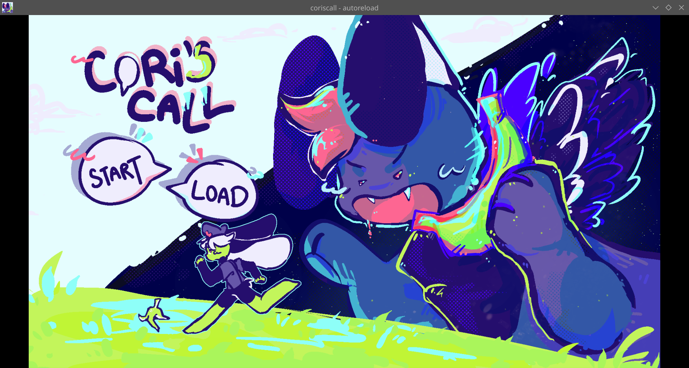
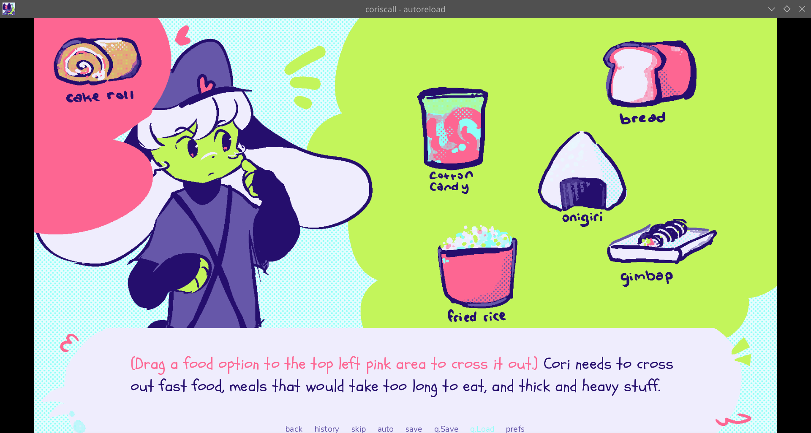

# cori's call
A visual novel about Cori, a delivery rabbit who receives a prank call. because surely nobody is serious when they order food delivery at 4:33 am, right?

# screenshots

# how I made this
I first thought of this mini vn idea in April 2026, and intended to finish that month. I didn't end up finishing in april because I procrastinated lol. I picked this up in July with intentions to make a "mini visual novel," but I accidentally became too invested. I used Renpy for the coding, and Krita to make the art. No AI was used, just a bunch of tutorials and documentation :D When I've shipped this game I'll use itch.io to publish! 

# how to play
web playable will be available on itch.io! Not mobile friendly unfortunately.

# cool features
I wanted to try to do some more technical things in this vn, and get deeper into Renpy!
* animated and customized main menu with a parallax (very proud)
* drag & drop interactions!
* click-to-do interactions!
* interactive ending screen (trust)

# stuff I'd like to add
* finish the two endings that I haven't written yet
* finish story first!
* then, cooler gui!
* then, maybe minigames

# things I learned
* I got much more comfortable with using screens, and they are super duper versatile :D
* Since this visual novel was originally going to be short, I had no written plan and no flowchart :fear: learned not to do that again (I had to keep the ending conditions simple due to my lack of planning, but at least there are a lot of endings!)
* Also did lots more formatting the gui. I think the colour palette really helps bring the game's gui together!
* Next time I make a visual novel, I'll try to make some minigames with screens, and won't hesitate to change up the gui and screens lots! (Now that I do understand the stuff that is going on. yay!)

# full explanation of the story
Uh I will write one later. Feel free to dm me (herby) on slack with questions.